# Business Flow และ System Flow

เอกสารนี้อธิบายลำดับการทำงานของ **ระบบจองห้องเรียน (Classroom Booking System)**
โดยแยกมุมมองกระบวนการทางธุรกิจ (Business Flow) ออกจากลำดับการประมวลผลของระบบ
(System Flow) เพื่อใช้ประกอบรายงานโครงงาน

## 1. ผู้เกี่ยวข้องในระบบ

| ผู้เกี่ยวข้อง | หน้าที่หลัก |
| --- | --- |
| ผู้เยี่ยมชม | ดูรายการห้อง รายละเอียด และตารางการใช้ห้องโดยไม่ต้องเข้าสู่ระบบ |
| ผู้ใช้งาน (USER / STUDENT / TEACHER) | สมัครสมาชิก เข้าสู่ระบบ จอง แก้ไข ยกเลิก และเช็กอินการจองของตนเอง |
| ผู้ดูแลระบบ (ADMIN) | จัดการห้อง ผู้ใช้งาน และคำขอจอง อนุมัติ/ปฏิเสธ ควบคุมสถานะการใช้งาน และออกรายงาน |
| ระบบแจ้งเตือน | แจ้งเหตุการณ์สำคัญของการจองและแจ้งเตือนก่อนถึงเวลาใช้งาน |

---

# 2. Business Flow

Business Flow คือภาพรวมของขั้นตอนการทำงานเชิงธุรกิจ โดยไม่ลงรายละเอียดเทคโนโลยีหรือฐานข้อมูล

## 2.1 ภาพรวมการให้บริการ

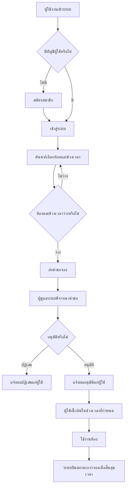

## 2.2 กระบวนการสมัครสมาชิกและเข้าสู่ระบบ

1. ผู้ใช้กรอกข้อมูลสมัครสมาชิก เช่น รหัสผู้ใช้ ชื่อ อีเมล เบอร์โทรศัพท์ รหัสผ่าน และบทบาทผู้ใช้
2. ระบบตรวจสอบความครบถ้วนและความซ้ำซ้อนของรหัสผู้ใช้หรืออีเมล
3. เมื่อสมัครสำเร็จ ผู้ใช้เข้าสู่ระบบด้วยอีเมลหรือรหัสผู้ใช้ร่วมกับรหัสผ่าน
4. ระบบตรวจสอบบัญชีและสถานะการใช้งานของบัญชี
5. หากถูกต้อง ระบบอนุญาตให้ใช้งานตามสิทธิ์ของบทบาทผู้ใช้

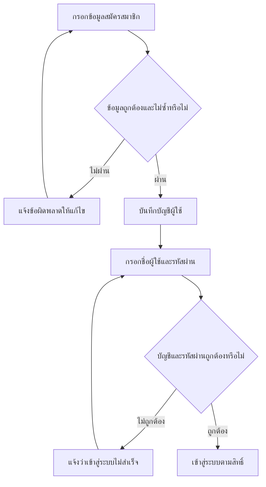

## 2.3 กระบวนการจองห้องเรียน

1. ผู้ใช้ค้นหาห้องตามอาคาร ชั้น ประเภทห้อง จำนวนที่นั่ง หรืออุปกรณ์ที่ต้องการ
2. ผู้ใช้เลือกห้อง ระบุวัน เวลา วัตถุประสงค์ จำนวนผู้เข้าร่วม และอุปกรณ์ที่ต้องการใช้
3. ระบบตรวจสอบว่าห้องเปิดใช้งาน รองรับจำนวนผู้เข้าร่วม มีอุปกรณ์ที่เลือก และไม่มีการจองซ้อน
4. เมื่อผ่านเงื่อนไข ระบบสร้างรายการจองสถานะ `PENDING` (รออนุมัติ)
5. ระบบแจ้งให้ผู้ใช้ทราบว่าคำขอจองถูกสร้างแล้ว
6. ผู้ดูแลระบบพิจารณาและแจ้งผลการอนุมัติหรือปฏิเสธ

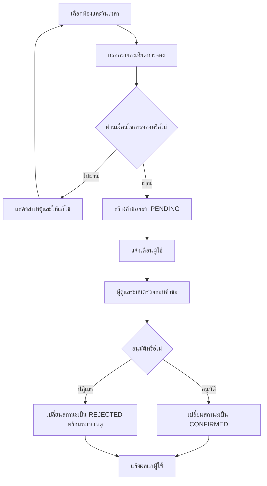

### กฎธุรกิจของการจอง

- จองได้เฉพาะห้องที่มีสถานะ `ACTIVE`
- จำนวนผู้เข้าร่วมต้องไม่เกินความจุของห้อง
- อุปกรณ์ที่ร้องขอต้องมีอยู่ในห้องนั้น
- ช่วงเวลาจองต้องอยู่ในเวลาที่ระบบกำหนด และต้องไม่เกินระยะเวลาสูงสุด
- ต้องจองล่วงหน้าไม่เกินจำนวนวันที่ระบบกำหนด
- ช่วงเวลาจองต้องไม่ซ้อนกับการจองที่ยังมีผลอยู่
- เจ้าหน้าที่หรือผู้ดูแลระบบสามารถจองแทนผู้ใช้อื่นได้ตามสิทธิ์

## 2.4 กระบวนการอนุมัติหรือปฏิเสธการจอง

1. ผู้ดูแลระบบเปิดรายการคำขอที่รออนุมัติ
2. ตรวจสอบห้อง ช่วงเวลา วัตถุประสงค์ และข้อมูลผู้จอง
3. หากอนุมัติ ระบบตรวจสอบเวลาชนซ้ำอีกครั้งก่อนเปลี่ยนสถานะเป็น `CONFIRMED`
4. หากปฏิเสธ ผู้ดูแลระบบระบุหมายเหตุ และระบบเปลี่ยนสถานะเป็น `REJECTED`
5. ระบบบันทึกประวัติการดำเนินการและส่งการแจ้งเตือนให้ผู้จอง

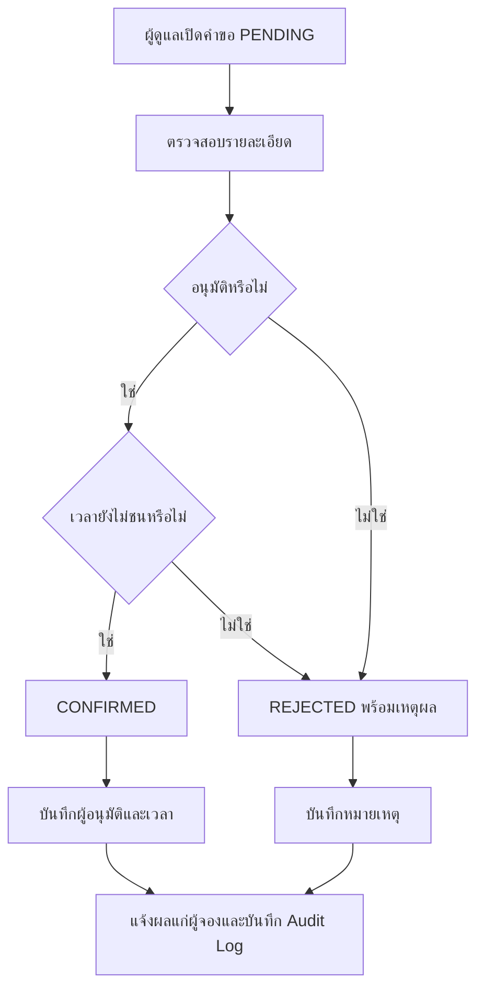

## 2.5 กระบวนการใช้งานห้องและปิดรายการจอง

1. ผู้ใช้ที่ได้รับอนุมัติจะได้รับการแจ้งเตือนก่อนถึงเวลาใช้งาน
2. ผู้ใช้เช็กอินได้เฉพาะภายในช่วงเวลาที่ระบบกำหนด
3. เมื่อเช็กอินสำเร็จ สถานะเปลี่ยนจาก `CONFIRMED` เป็น `IN_USE`
4. เมื่อสิ้นสุดเวลาการจอง ระบบเปลี่ยนสถานะ `IN_USE` เป็น `COMPLETED`
5. หากผู้ใช้ไม่เช็กอินภายในกำหนด ระบบเปลี่ยนสถานะจาก `CONFIRMED` เป็น `NO_SHOW`

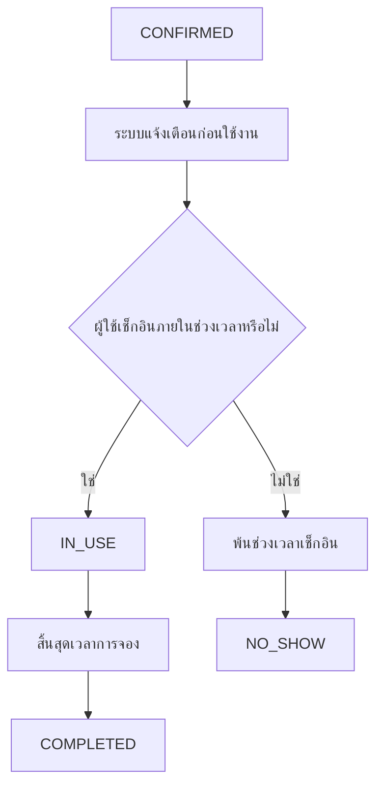

## 2.6 กระบวนการแก้ไขและยกเลิกการจอง

- ผู้ใช้แก้ไขรายการได้เฉพาะเมื่อสถานะเป็น `PENDING`
- ระบบตรวจสอบเงื่อนไขการจองและเวลาซ้อนใหม่ทุกครั้งก่อนบันทึกการแก้ไข
- ผู้ใช้ยกเลิกได้เมื่อสถานะเป็น `PENDING` หรือ `CONFIRMED`
- ผู้ใช้ทั่วไปต้องยกเลิกล่วงหน้าตามเวลาขั้นต่ำที่กำหนด ส่วนผู้ดูแลระบบมีสิทธิ์ยกเลิกได้
- ระบบบันทึกเหตุผลการยกเลิก ประวัติการเปลี่ยนแปลง และส่งการแจ้งเตือน

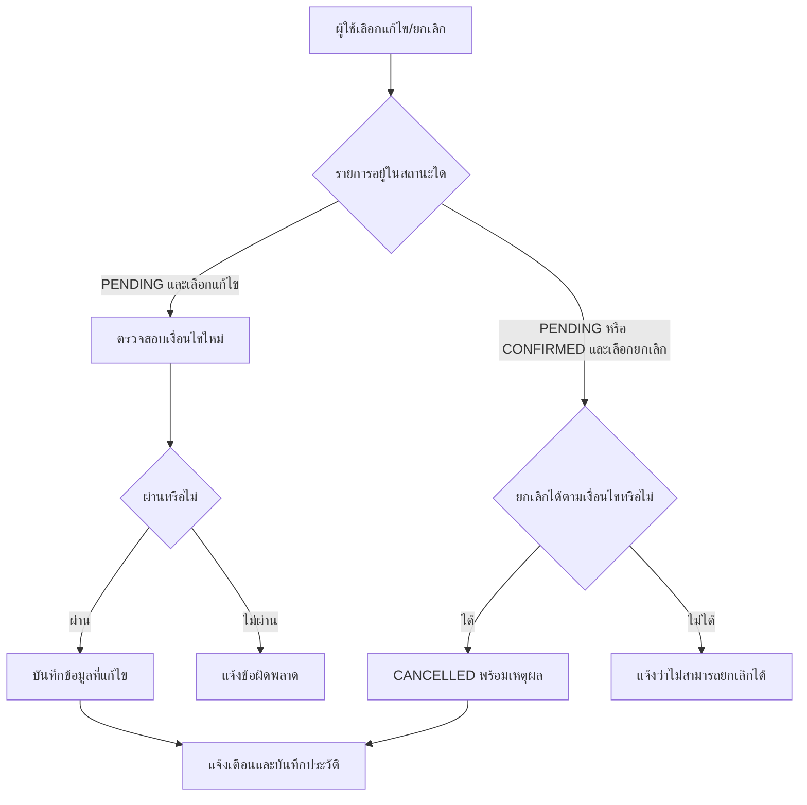

## 2.7 กระบวนการจัดการข้อมูลโดยผู้ดูแลระบบ

ผู้ดูแลระบบดำเนินการได้ดังนี้

1. จัดการข้อมูลห้องเรียน: เพิ่ม แก้ไข ปรับสถานะ และอัปโหลดรูปภาพห้อง
2. จัดการผู้ใช้: สร้างบัญชี ดูรายการผู้ใช้ และเปลี่ยนสถานะบัญชี
3. จัดการการจอง: อนุมัติ ปฏิเสธ เริ่มใช้งาน ปิดการใช้งาน กำหนดไม่มาตามนัด หรือยกเลิกรายการ
4. ติดตามข้อมูลผ่านแดชบอร์ด รายงานสรุป รายงานส่งออก CSV และ Audit Log

---

# 3. System Flow

System Flow คือการอธิบายการทำงานเชิงเทคนิค ตั้งแต่หน้าจอผู้ใช้ การเรียก API การตรวจสอบข้อมูล การประมวลผล และฐานข้อมูล

## 3.1 ภาพรวมสถาปัตยกรรมการไหลของข้อมูล

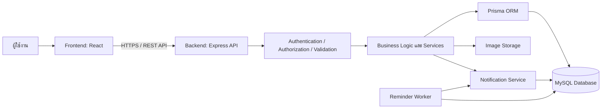

## 3.2 System Flow: การยืนยันตัวตนและกำหนดสิทธิ์

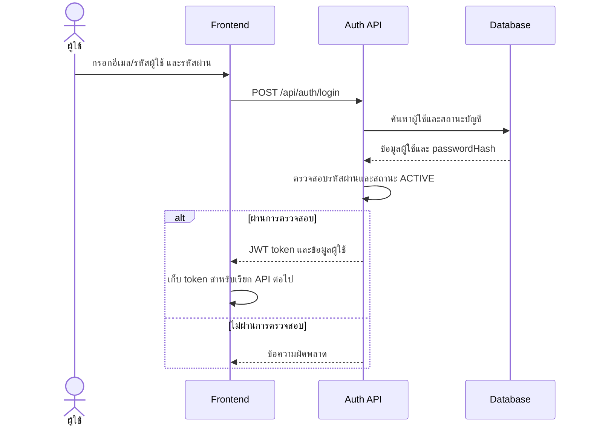

เมื่อเรียก API ที่ต้องเข้าสู่ระบบ Frontend จะส่ง `Authorization: Bearer <token>` ไปยัง Backend จากนั้นระบบตรวจสอบ token และตรวจสอบบทบาท (`USER`, `STUDENT`, `TEACHER`, `ADMIN`) ก่อนอนุญาตให้ดำเนินการ

## 3.3 System Flow: การค้นหาห้องและตรวจสอบตารางว่าง

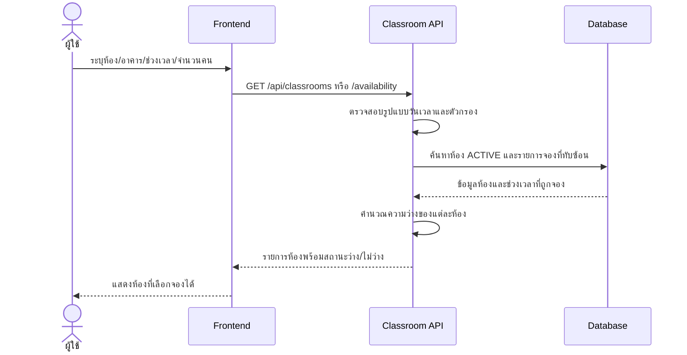

## 3.4 System Flow: การสร้างคำขอจอง

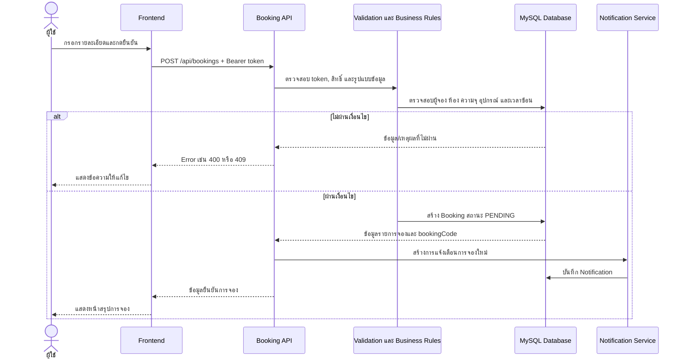

### ลำดับการตรวจสอบก่อนสร้างหรือแก้ไขการจอง

1. ตรวจสอบข้อมูลนำเข้า: ห้อง วัตถุประสงค์ จำนวนผู้เข้าร่วม วันเริ่ม และวันสิ้นสุด
2. ตรวจสอบวันเวลา: เวลาเริ่มต้องก่อนเวลาสิ้นสุด และอยู่ภายในกฎการให้บริการ
3. ตรวจสอบผู้จอง: มีบัญชีอยู่จริง อยู่สถานะ `ACTIVE` และมีสิทธิ์จองแทนหรือไม่
4. ตรวจสอบห้อง: มีอยู่จริงและมีสถานะ `ACTIVE`
5. ตรวจสอบความจุและอุปกรณ์ของห้อง
6. ตรวจสอบการจองซ้อนในช่วงเวลาเดียวกัน
7. บันทึกรายการในธุรกรรม เพื่อป้องกันปัญหาจองซ้อนจากคำขอพร้อมกัน
8. สร้างเลขอ้างอิง `bookingCode` และบันทึกสถานะเริ่มต้นเป็น `PENDING`

## 3.5 System Flow: การอนุมัติหรือปฏิเสธโดยผู้ดูแลระบบ

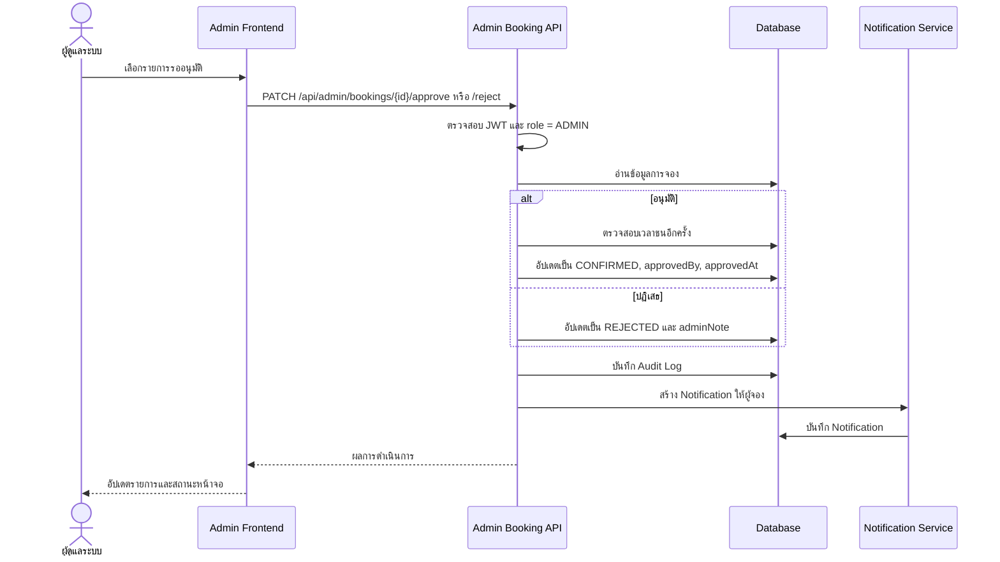

## 3.6 System Flow: การเช็กอิน การเปลี่ยนสถานะอัตโนมัติ และการแจ้งเตือน

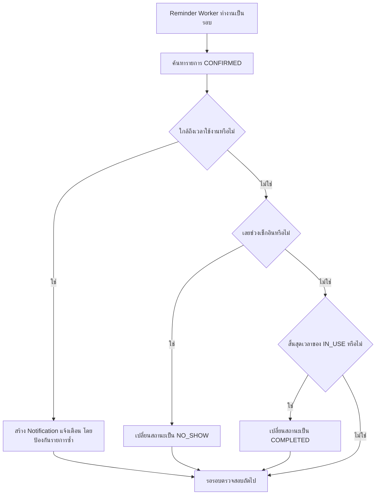

การเช็กอินจากผู้ใช้ทำงานดังนี้

1. Frontend ส่ง `POST /api/bookings/{id}/check-in` พร้อม token
2. Backend ตรวจสอบว่าเป็นเจ้าของรายการหรือผู้มีสิทธิ์จัดการ
3. ตรวจสอบว่าสถานะปัจจุบันเป็น `CONFIRMED`
4. ตรวจสอบว่าเวลาปัจจุบันอยู่ในช่วงเช็กอินที่อนุญาต
5. อัปเดตสถานะเป็น `IN_USE` บันทึก `checkedInAt` และสร้าง Audit Log

## 3.7 System Flow: การจัดการห้อง ผู้ใช้ และรายงาน

| งานระบบ | การไหลของข้อมูล |
| --- | --- |
| จัดการห้อง | Admin Frontend → Admin API → ตรวจสอบสิทธิ์ ADMIN → ตรวจสอบข้อมูล → Prisma → Classroom table → Audit Log → ส่งผลกลับหน้าจอ |
| อัปโหลดรูปห้อง | Admin Frontend → Upload API → ตรวจชนิด/ขนาดไฟล์ → Image Storage → คืน URL → บันทึก `imageUrl` ของห้อง |
| จัดการผู้ใช้ | Admin Frontend → Admin API → ตรวจสอบสิทธิ์ ADMIN → User table → Audit Log → ส่งผลกลับหน้าจอ |
| แดชบอร์ด | Admin Frontend → Dashboard API → รวมผลจาก User / Classroom / Booking → ส่งสถิติสรุปกลับ |
| รายงาน/CSV | Admin Frontend → Reports API พร้อมตัวกรอง → Query ข้อมูล Booking ที่เกี่ยวข้อง → สร้างผลสรุปหรือไฟล์ CSV → ดาวน์โหลด/แสดงผล |
| การแจ้งเตือน | Frontend → Notifications API → ตรวจสอบเจ้าของข้อมูล → Notification table → แสดงรายการ/จำนวนที่ยังไม่ได้อ่าน |

---

# 4. สถานะของการจอง (Booking Lifecycle)

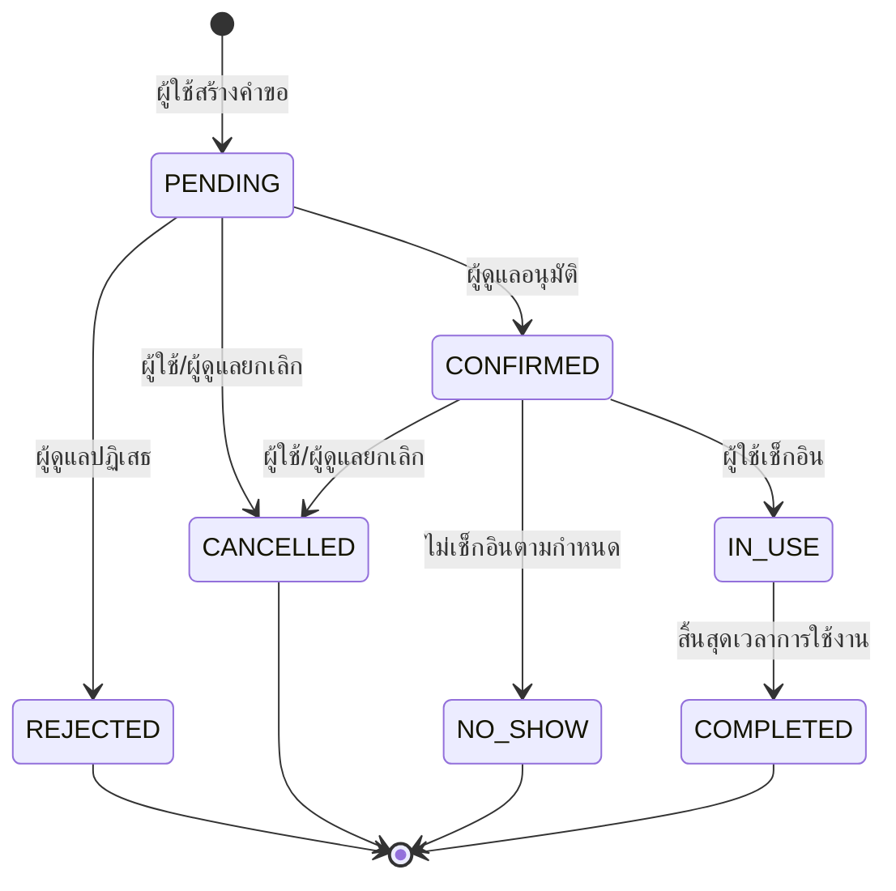

| สถานะ | ความหมาย | ผู้/ระบบที่เปลี่ยนสถานะ |
| --- | --- | --- |
| `PENDING` | คำขอจองที่รอการพิจารณา | ระบบเมื่อผู้ใช้สร้างคำขอ |
| `CONFIRMED` | รายการจองได้รับการอนุมัติ | ผู้ดูแลระบบ |
| `REJECTED` | รายการจองถูกปฏิเสธ | ผู้ดูแลระบบ |
| `CANCELLED` | รายการจองถูกยกเลิก | ผู้ใช้หรือผู้ดูแลระบบ |
| `IN_USE` | ผู้ใช้เช็กอินและกำลังใช้งานห้อง | ผู้ใช้หรือผู้มีสิทธิ์ |
| `COMPLETED` | การใช้งานสิ้นสุดแล้ว | ระบบอัตโนมัติหรือผู้ดูแลระบบ |
| `NO_SHOW` | ผู้ใช้ไม่เช็กอินตามเวลาที่กำหนด | ระบบอัตโนมัติหรือผู้ดูแลระบบ |

---

# 5. ข้อมูลหลักที่ไหลในระบบ

| ข้อมูล | แหล่งกำเนิด | การใช้งานหลัก |
| --- | --- | --- |
| ข้อมูลผู้ใช้ | การสมัครสมาชิก / ผู้ดูแลสร้าง | ยืนยันตัวตน กำหนดสิทธิ์ และระบุผู้จอง |
| ข้อมูลห้อง | ผู้ดูแลระบบ | แสดงห้อง ตรวจความจุ อุปกรณ์ และสถานะห้อง |
| ข้อมูลการจอง | ผู้ใช้งาน / ผู้ดูแลระบบ | ตรวจสอบตาราง อนุมัติ เช็กอิน สรุปรายงาน |
| ข้อมูลการแจ้งเตือน | ระบบเมื่อเกิดเหตุการณ์ | แจ้งการสร้าง แก้ไข ยกเลิก อนุมัติ ปฏิเสธ และเตือนก่อนใช้งาน |
| ประวัติการทำรายการ | ระบบ | ตรวจสอบย้อนหลังผ่าน Audit Log |

# 6. สรุปสำหรับรายงาน

ระบบจองห้องเรียนช่วยให้ผู้ใช้สามารถค้นหา ตรวจสอบห้องว่าง และส่งคำขอจองได้อย่างเป็นระบบ ขณะที่ผู้ดูแลระบบสามารถควบคุมข้อมูลห้อง ผู้ใช้ และการอนุมัติการจองได้จากส่วนจัดการกลาง ระบบตรวจสอบกฎธุรกิจสำคัญก่อนบันทึกข้อมูลทุกครั้ง เช่น สถานะห้อง ความจุ อุปกรณ์ ระยะเวลาจอง และเวลาซ้อน พร้อมบันทึกประวัติการทำรายการและแจ้งเตือนผู้ใช้ตลอดวงจรการจอง ตั้งแต่การสร้างคำขอจนสิ้นสุดการใช้งานห้อง
