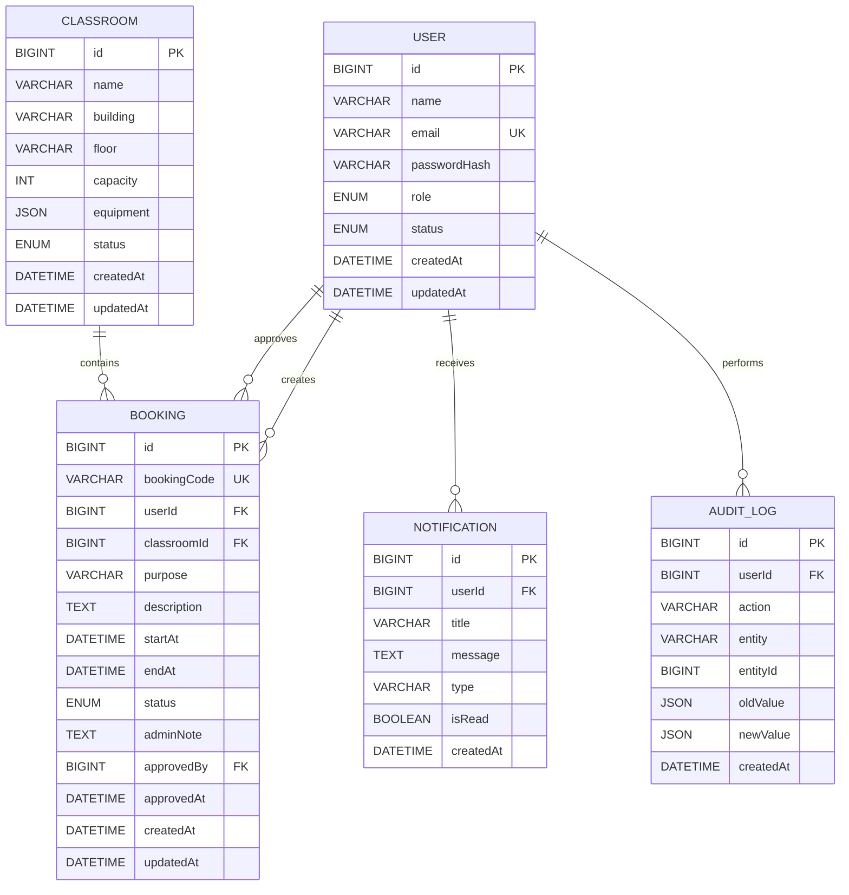

# Database Entity Relationship Diagram

## ความสัมพันธ์สำคัญ

- User หนึ่งคนสร้าง Booking ได้หลายรายการ
- Admin เป็น User เช่นกัน และสามารถอนุมัติ Booking ได้
- Classroom หนึ่งห้องมี Booking ได้หลายรายการ
- User หนึ่งคนได้รับ Notification ได้หลายรายการ
- User หนึ่งคนสร้าง Audit Log ได้หลายรายการ
